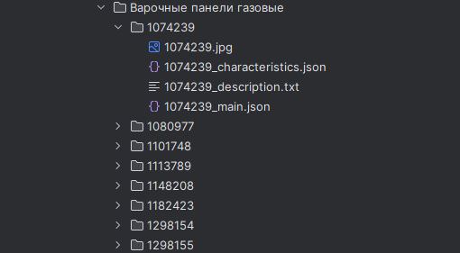

With this code, you can parse the DNS site. Parsing goes by site categories.
The folders that store product data are similar to the category hierarchy.
Example:

For each product, a folder with the name of the item number will be created.
These folders store the following information
- characteristics
- basic information
    - the product's name
    - product number
- Product Description
- product image
Example:

Also, in each section, the image of this category and information about product brands will be saved.
- 

Examples of getting answers can be viewed in the html templates folder.